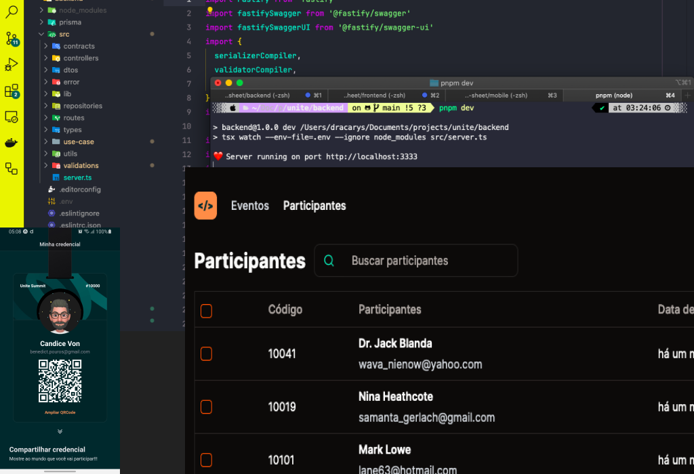

<p align="center">
  
</p>

# Descrição do Projeto

Este projeto é uma aplicação Full Stack que utiliza Node.js no backend para gerenciar cadastros de usuários, React na web para listar usuários com paginação e React Native no mobile para cadastro de usuários e geração de tickets virtuais.

## Tecnologias Utilizadas

### [Backend](https://github.com/Gui-dev/unite/tree/main/backend)

- Node.js
- Express.js
- Banco de dados (PostgreSQL)

### [Web](https://github.com/Gui-dev/unite/tree/main/frontend)

- React
- React Router
- Axios

### [Mobile](https://github.com/Gui-dev/unite/tree/main/mobile)

- React Native
- Expo
- Moti

## Funcionalidades

### Backend

- Cadastro de usuários
- Autenticação de usuários

### Web

- Listagem de usuários com paginação
- Busca por usuários
- Filtragem de usuários
- Páginação

### Mobile

- Cadastro de usuários
- Geração de ticket virtual

## Pré-requisitos

- Node.js instalado
- npm ou yarn instalado
- Um banco de dados (ex: MySQL, PostgreSQL)
- Para desenvolvimento mobile:
  - Expo instalado
  - Um simulador ou dispositivo Android/iOS

**Instalação e Execução:**

1.  Clone o repositório:

Bash

```
git clone https://github.com/Gui-dev/unite.git

```

## Instalação

1. Depois de clonar o repositório, entre em cada dirétorio e siga as instruções

## Licença

Este projeto está licenciado sob a licença MIT.
