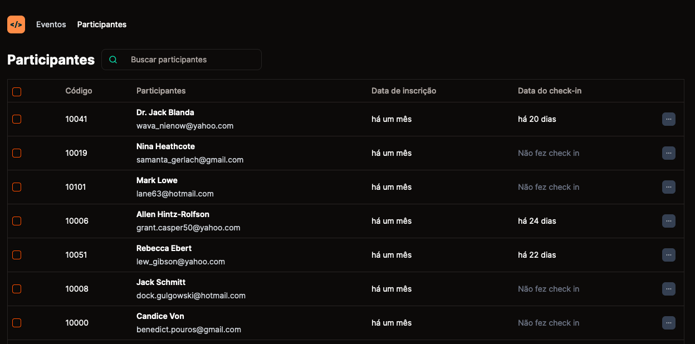
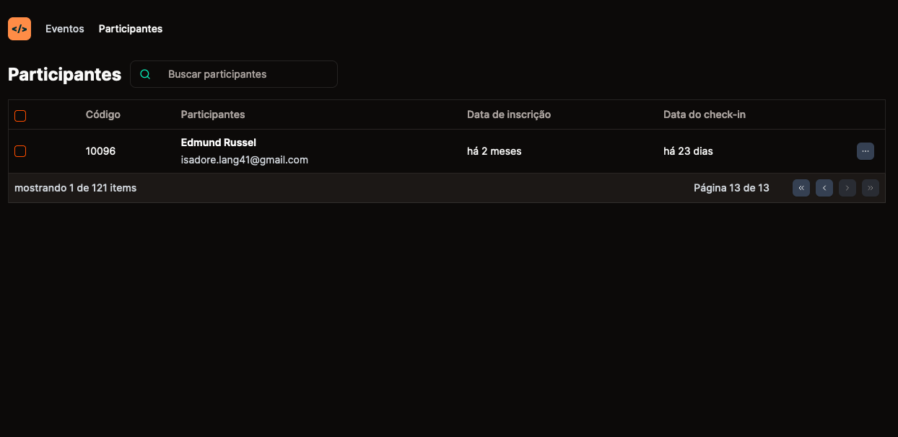

# Pass.in

No app Web listará todos os usuários cadastrados no evento, listando 10 usuários por página,
e ainda você pode fazer a busca de um usuário por nome.

## ✨ Technologies used

- React
- Next.js
- Páginação

**Screens**

<p align="center">
  
  
</p>

**Pré-requisitos:**

- Navegador web moderno (Chrome, Edge, etc.)
- NodeJS

**Instalação e Execução:**

1.  Clone o repositório:

Bash

```
git clone https://github.com/Gui-dev/projects-expert.git

```

4.  Execute a aplicação:

Bash

```
npm ci
```

Bash

```
npm run dev
```

5.  Acesse a aplicação em http://localhost:3000 no seu navegador.

**Contribuição:**

Agradecemos a sua contribuição para este projeto! Você pode contribuir submetendo issues e pull requests no repositório GitHub.

**Licença:**

Este projeto está licenciado sob a licença MIT.
