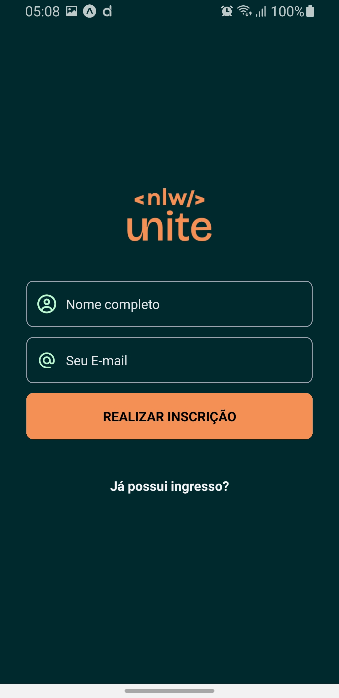

# Pass.in

<p align="center">
  
  
  
</p>

## ✨ Technologies used

- [React](https://reactjs.org)
- [React Native](https://reactnative.dev)
- [Expo](https://expo.io)
- [TypeScript](https://www.typescriptlang.org)
- [Native wind](https://www.nativewind.dev/)
- [Moti](https://moti.fyi/)

**Pré-requisitos:**

- Navegador web moderno (Chrome, Edge, etc.)
- NodeJS

**Instalação e Execução:**

4.  Execute a aplicação:

Bash

```
npm ci
```

Bash

```
npm run start
```

5.  Acesse o terminal e leia o QRCode com seu smartphone,
    ou abra no simulador do Android Studio ou do Xcode

**Contribuição:**

Agradecemos a sua contribuição para este projeto! Você pode contribuir submetendo issues e pull requests no repositório GitHub.

**Licença:**

Este projeto está licenciado sob a licença MIT.
